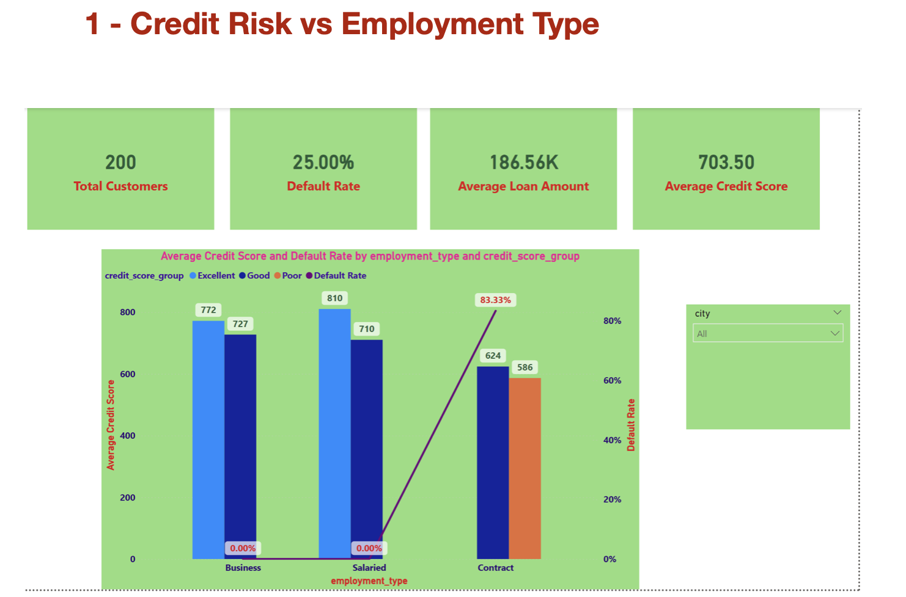
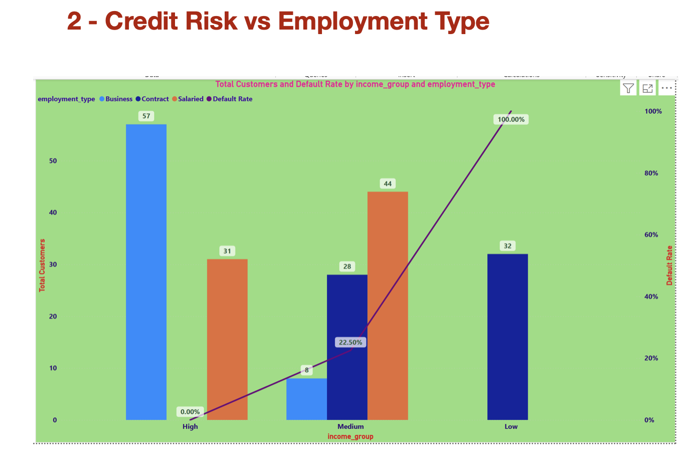
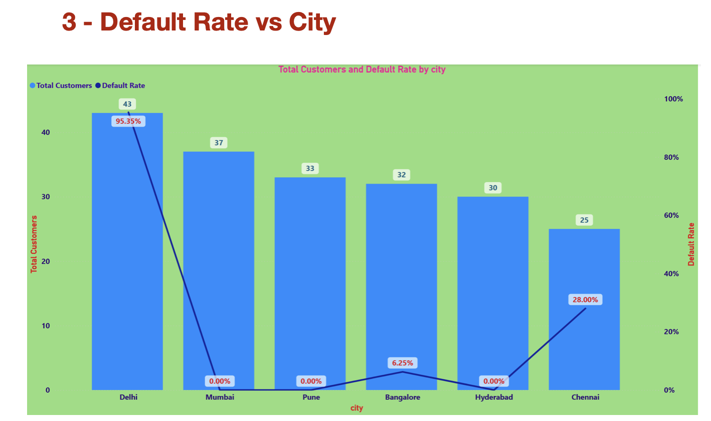
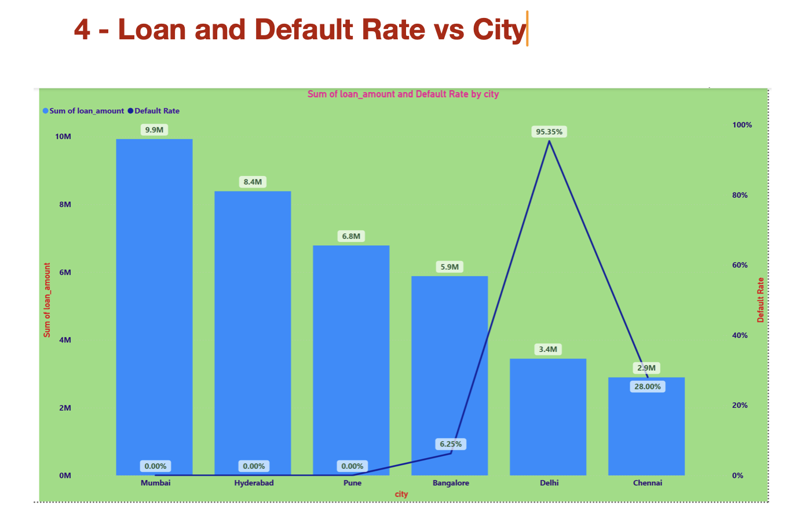

##  Project Overview

This project analyzes loan customer data to identify high-risk borrowers and improve credit risk management. Using Python, SQL, Machine Learning, and Power BI, this project provides predictive insights and interactive dashboards for risk monitoring.

---

##  Business Objective

• Predict loan default probability  
• Identify high-risk customer segments  
• Improve portfolio risk management  
• Enable data-driven lending decisions  

---

##  Tools & Technologies

• Python (Pandas, NumPy, Scikit-learn, XGBoost)  
• SQL (SQLite)  
• Power BI  
• Jupyter Notebook  

---

##  Key Analysis Performed

• Data cleaning and preprocessing  
• Feature engineering  
• Risk segmentation  
• Default rate analysis  
• Predictive modeling using Logistic Regression and XGBoost  

---

##  Power BI Dashboard Preview

---

##  Business Impact

Provides risk insights to help financial institutions reduce loan defaults and optimize lending strategies.
